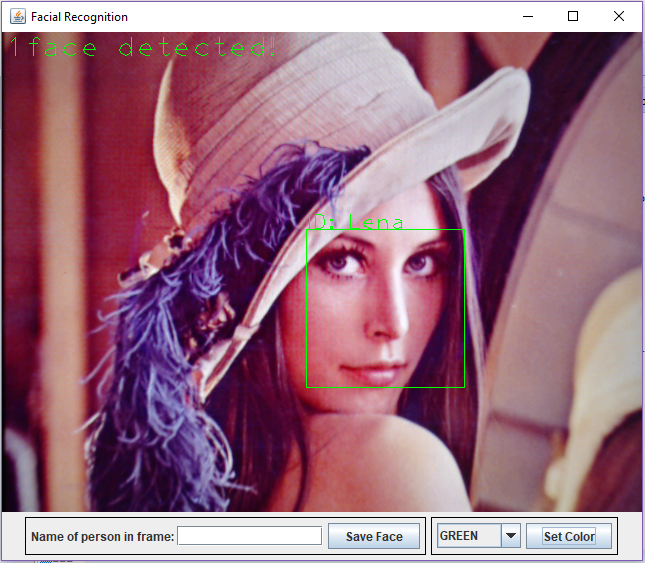

  
  
  
  

Basic facial detection and recognition using OpenCV.

## Prerequisites

### Languages
* [Java](https://go.java/index.html?intcmp=gojava-banner-java-com)

### Libraries
* [OpenCV](https://opencv.org/about.html)

## Getting Started

The minimum version requirements for each additional software are listed in the badges at the top of the readme.
It is recommended that you install the most updated version at your time of installation.

### Installing Java

Visit the <a href="http://www.oracle.com/technetwork/java/javase/downloads/index.html">Java Downloads</a> 
page and select the version of your choice.
Run the installer and follow the instructions provided.

### Building OpenCV

Visit the <a href="https://opencv.org/releases.html">OpenCV Releases</a> page and select the version of your choice.
Note: older versions of this library may work with this code, but this is not gauranteed.
Please read the tutorial on
<a href="https://github.com/opencv-java/opencv-java-tutorials/blob/master/docs/source/01-installing-opencv-for-java.rst">
Installing OpenCV for Java</a> in order to correctly build OpenCV for your operating system.

## License
This project is licensed under the MIT License - see the [LICENSE.md](LICENSE.md) file for details
